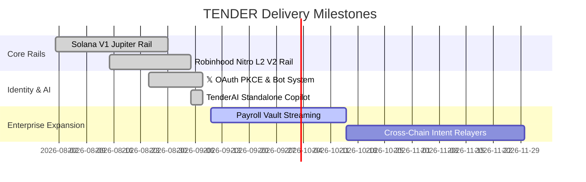

# TENDER — Product Requirements Document (PRD) & Technical Overview

> **Version:** 2.4.0  
> **Status:** Production / Live  
> **Last Updated:** September 2026  
> **Authors:** TenderRWA Engineering Team  
> **Domains:** [tenderrwa.com](https://tenderrwa.com) (Terminal & DApp) · [ai.tenderrwa.com](https://ai.tenderrwa.com) (TenderAI Copilot) · [api.tenderrwa.com](https://api.tenderrwa.com) (Core Settlement API)

---

## 1. Executive Summary & Problem Statement

### 1.1 The Core Thesis
Every legacy and Web3 payment rail asks the **sender** what token or currency they want to send. **TENDER inverts this paradigm** by empowering the **receiver** to declare what assets they want to accumulate.

A receiver defines their target portfolio election once—for example:
- `60% SPYx` (Tokenized S&P 500)
- `30% USDC` (Stable Reserve)
- `10% GLDx` (Tokenized Gold)

From then on, any inbound payment in liquid working capital (SOL, USDC, ETH, USDG, or listed tokens) **settles atomically into the receiver's target portfolio in a single transaction**. The sender spends what they hold; the receiver receives what they want to own. Payday becomes an automatic buy order for long-term wealth.

### 1.2 The Two-Rail Architecture
TENDER operates across two complementary high-throughput settlement rails:
1. **Solana Rail (V1)**: High-speed settlement using Raydium/Jupiter routing for tokenized RWAs (xStocks, Ondo, tokenized commodities) with Token-2022 scaled UI dividend multipliers.
2. **Robinhood Chain Rail (V2)**: EVM Nitro L2 rollup (Chain ID: `4663`) utilizing Uniswap V4 multi-leg execution for native ETH, USDG stablecoins, and tokenized equities (`SPCX`, `AAPL`, `NVDA`, `TSLA`, `MSFT`, `GOOGL`, `AMZN`).

---

## 2. System Architecture & Component Map

```
                     ┌─────────────────────────────────────────────────────────┐
                     │                     USER INTERFACES                     │
                     └─────────────────────────────────────────────────────────┘
                                   │                               │
       ┌───────────────────────────┴───────────────┐   ┌───────────┴────────────────────────┐
       │   TENDER Terminal (Main Site)             │   │   TenderAI Copilot (Standalone)    │
       │   Domain: tenderrwa.com                   │   │   Domain: ai.tenderrwa.com         │
       │   Stack: TanStack Start + React 19        │   │   Stack: Vite + React 19 + Wagmi   │
       │   Auth: 𝕏 OAuth 2.0 PKCE + EVM/Solana Sig │   │   Functions: Vercel Edge Serverless│
       └───────────────────────────────────────────┘   └────────────────────────────────────┘
                                   │                               │
                                   ▼                               ▼
                     ┌─────────────────────────────────────────────────────────┐
                     │          CORE BACKEND & ROUTING ENGINE                  │
                     │          Domain: api.tenderrwa.com (Render Dedicated)   │
                     │          Runtime: Bun + Express + TypeScript            │
                     └─────────────────────────────────────────────────────────┘
                            │                   │                   │
            ┌───────────────┴───┐       ┌───────┴───────┐   ┌───────┴──────────────┐
            ▼                   ▼       ▼               ▼   ▼                      ▼
     ┌─────────────┐    ┌─────────────┐   ┌───────────────┐   ┌──────────────────────────┐
     │  V1 Rail    │    │  V2 Rail    │   │  𝕏 Bot Agent  │   │  TenderAI Context Engine │
     │  Solana     │    │  Robinhood  │   │  @TenderRWABot│   │  Groq LLM + Uniswap V4   │
     │  Jupiter    │    │  Uniswap V4 │   │  Pending Queue│   │  Quoting Service         │
     └─────────────┘    └─────────────┘   └───────────────┘   └──────────────────────────┘
            │                   │
            ▼                   ▼
    Solana SPL Assets    Robinhood EVM
    (xStocks, Ondo)      (SPCX, USDG, ETH)
```

---

## 3. Product Modules & Features

### 3.1 Receiver Handle & Portfolio Elections
- **Identity Standard**: Human-readable handle namespaces (e.g. `@timbook`, `@helen2swift`).
- **Portfolio Weighting**: 100% total allocation split in basis points (`bps`, 1% = 100 bps).
- **Anti-Custody Guarantee**: All allocations swap and land directly in the receiver's personal non-custodial wallet with zero intermediate escrow balances held by TENDER.

### 3.2 Atomic Multi-Leg Quoting Engine
- **V1 (Solana)**: Queries Jupiter DEX aggregator for best route, computes proportional swap instructions, checks price impact, and bundles transfers atomically.
- **V2 (Robinhood Chain)**: Evaluates Uniswap V4 pool states, calculates tick-level execution prices for target equities (`SPCX`, `AAPL`, etc.), and returns precise atomic split allocations.
- **Slippage Fallback**: If an equity market experiences illiquidity or exceeds max slippage tolerance, the affected leg automatically safe-settles into stablecoin (`USDC`/`USDG`) rather than aborting or reverting the entire payment.

### 3.3 𝕏 (@Twitter) Bot Integration & Identity Binding
- **Handle Sovereignty**: Prevents impersonation by linking on-chain wallet addresses to authentic 𝕏 accounts via **OAuth 2.0 PKCE** verified against cryptographic message signatures from the user's wallet.
- **Natural Language Bot Parsing**: `@TenderRWABot` parses public and direct interactions:
  - `Pay @timbook 50 USDG`
  - `Send NFT 0x4a0E... to @timbook`
  - `Quote 100 USDG for @helen2swift`
- **Pending Settlement Queue**: When a payment is staged via 𝕏, it appears in the receiver's terminal queue with live polling, ready for 1-click execution.

### 3.4 TenderAI: Autonomous Settlement Copilot (`ai.tenderrwa.com`)
- **Conversational Financial Assistant**: Real-time natural language terminal powered by Groq LLM with context injection of verified assets, active handle profiles, and live DEX quotes.
- **Interactive Action Cards**:
  - **Settlement Order Card**: Visual split bar illustrating exact allocations, receiver addresses, and a 1-click **Sign & Settle Now** button.
  - **Asset Universe Card**: Displays eligible tokenized equities and stablecoins with atomic settlement status.
  - **NFT Transfer Card**: Direct contract resolution and staging for handle-based NFT transfers.
- **Resilient Web3 Signing Engine**: Dual-path transaction broadcasting using Wagmi with automatic fallback to native **EIP-1193** provider calls (`wallet_switchEthereumChain` / `eth_sendTransaction`), ensuring universal support across Rainbow, MetaMask, Rabby, and Coinbase Wallet.
- **Serverless Architecture**: Client browser calls same-origin Vercel Serverless Functions (`/api/chat`, `/api/auth/x-account`, `/api/context`), isolating external backend URLs and enforcing server-side parameter validation.

---

## 4. Technical Specifications & API Reference

### 4.1 Supported Asset Catalogs

#### Robinhood Chain (V2 Rail · Chain ID: 4663)
| Ticker | Asset Name | Contract Address | Type |
| :--- | :--- | :--- | :--- |
| **ETH** | Native Ether | `0x0000000000000000000000000000000000000000` | Native Gas (18 decimals) |
| **USDG** | Global Dollar | `0x2c0DE25A0F575294e09e1e245c7117e3a9F64B7b` | Stablecoin (6 decimals) |
| **SPCX** | S&P 500 Composite Token | `0x199A6D2F1B2521A16C2F7f19b21EcDcb590D05C2` | Tokenized Equity (18 decimals) |
| **AAPL** | Apple Inc. Tokenized Stock | `0x4296A1b933d3C9945D8c00FaDbbFe3F578B2c5D5` | Tokenized Equity (18 decimals) |
| **NVDA** | NVIDIA Corp Tokenized Stock| `0x7f032dDEfFd154C4F04690C6356715f2e60058b7` | Tokenized Equity (18 decimals) |
| **TSLA** | Tesla Inc. Tokenized Stock | `0x9E7146522cAcAb7dC476f5787498cbe073B4D30B` | Tokenized Equity (18 decimals) |

#### Solana (V1 Rail · Mainnet-Beta)
| Ticker | Asset Name | Mint Address | Type |
| :--- | :--- | :--- | :--- |
| **USDC** | USD Coin | `EPjFWdd5AufqSSqeM2qN1xzybapC8G4wEGGkZwyTDt1v` | SPL Stablecoin (6 decimals) |
| **SOL** | Native Solana | `So11111111111111111111111111111111111111112` | Native Gas (9 decimals) |
| **SPYx** | Tokenized S&P 500 ETF | `SPYx...` | Token-2022 (Scaled Multiplier) |
| **GLDx** | Tokenized Gold | `GLDx...` | Token-2022 (Scaled Multiplier) |

---

### 4.2 Key REST API Endpoints (`https://api.tenderrwa.com`)

#### Identity & Authentication
- `GET /api/v1/auth/x/account?wallet=<address>` (and alias `/api/v1/auth/x/status`): Returns verification status and bound 𝕏 handle.
- `GET /api/v1/auth/x/login`: Initiates PKCE OAuth challenge requiring signed wallet ownership message.

#### Settlement & Quoting (V2)
- `POST /api/v2/settle/quote`: Direct single-asset execution quote.
- `POST /api/v2/settle/election-quote`: Multi-leg portfolio quote for target handle (e.g. `recipientHandle: "timbook"`, `amountIn: 100`, `fromSymbolOrAddress: "USDG"`).
- `POST /api/v2/settle/confirm`: Records confirmed on-chain settlement receipts.
- `GET /api/v2/settle/history`: Fetches past settlements filtered by wallet or handle.

#### AI Copilot (V2)
- `POST /api/v2/ai/chat`: Context-aware conversational endpoint returning intent, natural reply, and executable action card.
- `GET /api/v2/ai/context`: Returns live registry of verified assets, handles, and network state.

---

## 5. Security & Trust Architecture

| Vector | TENDER Solution |
| :--- | :--- |
| **Custody Risk** | **Zero Escrow**: Funds are never pooled into an intermediary contract. Swaps route atomically into recipient wallets in the same transaction block. |
| **Impersonation** | **Cryptographic 𝕏 Binding**: Handles must be verified through OAuth PKCE paired with an on-chain signature from the wallet owner. |
| **Execution Slippage** | **Dual Quoting & Safe Fallback**: Maximum slippage bounds protect execution. Unfilled equity legs default to stablecoins (`USDC`/`USDG`). |
| **API Exposure** | **Serverless Function Layer**: Frontend queries pass through Vercel Edge functions (`ai/api/`), hiding internal API routing and secrets. |

---

## 6. Product Roadmap


