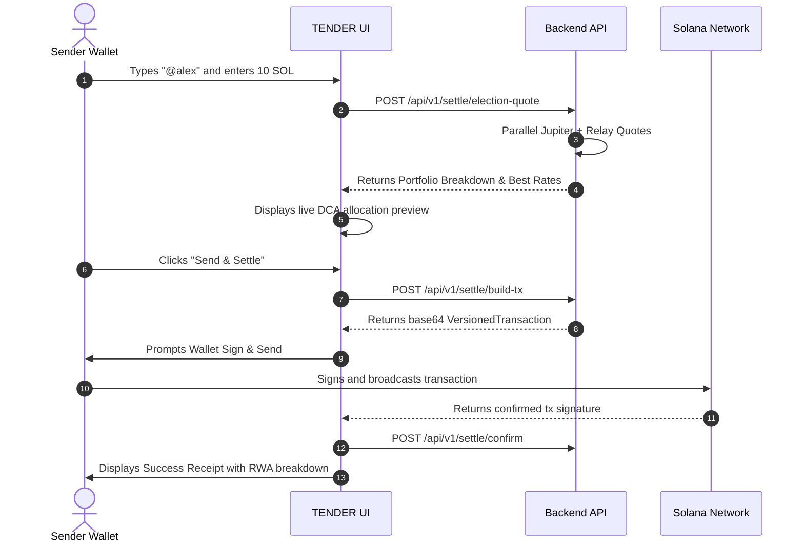

# TENDER — Complete Frontend Integration & Architectural Specification

> **Core Philosophy**: **"Get Paid in the Assets You'd Rather Hold"**
>
> **TENDER** is the first permissionless, non-custodial **receive-side RWA settlement rail on Solana**. Conventional payment rails ask the *sender* what to send; TENDER asks the *receiver* what they want to hold (e.g. `60% SPYx`, `30% USDC`, `10% GLDx`). When any sender pays a receiver's handle in SOL, USDC, or SPL tokens, TENDER executes an **atomic multi-leg swap** via a **Dual-Provider Engine (Jupiter Swap V6 + Relay.link V2)** and delivers the receiver's target portfolio directly to their wallet in a single transaction.

---

## 1. Environments & Base Endpoints

| Environment | Endpoint URL | Status |
| :--- | :--- | :--- |
| **Live Production API** | `https://api.tenderrwa.com` | Active (Always-on / Paid Tier) |
| **Direct Host Fallback** | `https://tender-api-jpw2.onrender.com` | Active |
| **Local Development API** | `http://localhost:3001` | Active |
| **Frontend Network** | Solana `mainnet-beta` | Active |

All API responses are standard JSON. No custom authorization headers are required for public quote and handle resolution endpoints.

---

## 2. Core Execution Architecture

```
                             Sender Payment
                       (Pays SOL / USDC / SPL)
                                  │
                                  ▼
┌──────────────────────────────────────────────────────────────────┐
│                   TENDER Dual-Provider Engine                    │
│                                                                  │
│  1. Resolve Receiver Handle & Portfolio Elections (bps)          │
│  2. Parallel Dual-Quoting: Jupiter API V6 vs. Relay.link V2      │
│  3. Select Best-Execution Route per Asset Leg                    │
│  4. Assemble Atomic Solana VersionedTransaction                  │
└─────────────────────────────────┬────────────────────────────────┘
                                  │
                                  ▼
                 Single Wallet Signature (Sender)
                                  │
        ┌─────────────────────────┼─────────────────────────┐
        ▼                         ▼                         ▼
   60% SPYx                  30% USDC                  10% GLDx
(S&P 500 Tokenized ETF)    (USD Coin Stable)       (Tokenized Physical Gold)
        │                         │                         │
        └─────────────────────────┼─────────────────────────┘
                                  ▼
                    Receiver Wallet Token Accounts
                     (100% Non-Custodial & Atomic)
```

---

## 3. TypeScript Interfaces & Data Models

Export these types in your frontend codebase (e.g., `src/types/tender.ts`):

```typescript
// ── RWA & Token Types ───────────────────────────────────────────────────────

export interface SolanaTokenInfo {
  slug?: string;
  symbol: string;
  name: string;
  mint: string;
  decimals: number;
  isNative?: boolean;
  isBaseCurrency?: boolean;
  underlyingTicker?: string;
  iconUrl?: string;
}

export interface AssetsResponse {
  baseCurrencies: SolanaTokenInfo[];
  featured: SolanaTokenInfo[];
  total: number;
  limit: number;
  offset: number;
  assets: SolanaTokenInfo[];
}

// ── Handle & Election Types ────────────────────────────────────────────────

export interface PortfolioElection {
  id?: number;
  symbol: string;
  mint: string;
  basisPoints: number; // 100 bps = 1.00% (Sum of active elections must = 10,000)
  percentage: number;  // 60 = 60%
  token?: SolanaTokenInfo;
}

export interface HandleDetailsResponse {
  handle: string;
  ownerWallet: string;
  metadata: Record<string, any>;
  elections: PortfolioElection[];
  totalBasisPoints: number;
  createdAt: string;
  updatedAt: string;
}

// ── Dual Provider & Settlement Types ───────────────────────────────────────

export interface ProviderQuoteSummary {
  provider: "jupiter" | "relay";
  outAmount: string;
  outAmountFormatted: string;
  priceImpactPct: number;
  rate?: string;
  success: boolean;
  error?: string;
}

export interface DualQuoteResponse {
  winner: "jupiter" | "relay";
  inputToken?: SolanaTokenInfo;
  outputToken?: SolanaTokenInfo;
  inAmount: string;
  inAmountFormatted: string;
  outAmount: string;
  outAmountFormatted: string;
  priceImpactPct: number;
  rate: string;
  providerComparison: {
    jupiter: ProviderQuoteSummary;
    relay: ProviderQuoteSummary;
    winnerReason: string;
  };
  rawWinnerQuote: {
    provider: "jupiter" | "relay";
    jupiterQuote?: any;
    relayQuote?: any;
  };
}

export interface PortfolioQuoteLeg {
  assetSymbol: string;
  assetMint: string;
  basisPoints: number;
  allocatedInAmount: string;
  allocatedInAmountFormatted: string;
  quote: DualQuoteResponse;
}

export interface ElectionQuoteResponse {
  recipientHandle?: string | null;
  recipientWallet: string;
  portfolioResult: {
    totalInAmount: string;
    totalInAmountFormatted: string;
    inputToken?: SolanaTokenInfo;
    legs: PortfolioQuoteLeg[];
  };
}

export interface BuildTxPlanResponse {
  provider: "jupiter" | "relay";
  base64Transaction?: string;
  relaySteps?: any[];
  details: {
    inAmount: string;
    outAmount: string;
    rate: string;
    priceImpactPct: number;
  };
}
```

---

## 4. Complete API Reference

### A. RWA Token Registry

#### `GET /api/v1/assets`
Returns base currencies (`SOL`, `USDC`), featured xStocks, and the full 714-asset directory with search.

* **Query Parameters**:
  * `q` *(optional)*: Search query string (e.g. `apple`, `NVDA`, `tesla`).
  * `featured` *(optional)*: `true` to return only featured xStocks.
  * `limit` *(optional, default: 100)*: Max items to return.
  * `offset` *(optional, default: 0)*: Pagination offset.

```typescript
// Example: Fetch featured xStocks for UI ticker
const res = await fetch("https://api.tenderrwa.com/api/v1/assets?featured=true");
const data: AssetsResponse = await res.json();
```

#### `GET /api/v1/assets/:symbolOrMint`
Quick lookup and alias resolution (e.g. `APPLE` → `AAPLx`, `SPY` → `SPYx`).

---

### B. Handle & Portfolio Elections

#### `GET /api/v1/handles/:handle`
Fetches handle ownership and active portfolio allocation.

```typescript
const res = await fetch("https://api.tenderrwa.com/api/v1/handles/alex");
const handleData: HandleDetailsResponse = await res.json();
```

#### `POST /api/v1/handles/register`
Claims/registers a handle for a connected wallet.

* **Body**:
```json
{
  "handle": "alex",
  "ownerWallet": "2aCStNyta182cUEry72GNNP7R2CcyErGWA8DLQVjjw3D",
  "metadata": { "displayName": "Alex Turner", "avatar": "https://..." },
  "elections": [
    { "symbol": "SPYx", "mint": "XsoCS1TfEyfFhfvj8EtZ528L3CaKBDBRqRapnBbDF2W", "basisPoints": 6000 },
    { "symbol": "USDC", "mint": "EPjFWdd5AufqSSqeM2qN1xzybapC8G4wEGGkZwyTDt1v", "basisPoints": 3000 },
    { "symbol": "GLDx", "mint": "Xs64245JybP9rgXJZJZcxKKRwqJnRpGKzoKtVNcyhoS", "basisPoints": 1000 }
  ]
}
```

#### `PUT /api/v1/handles/:handle/elections`
Updates the receiver's target asset allocation (validates that total basis points sum to 10,000).

```typescript
const res = await fetch("https://api.tenderrwa.com/api/v1/handles/alex/elections", {
  method: "PUT",
  headers: { "Content-Type": "application/json" },
  body: JSON.stringify({
    ownerWallet: walletPublicKey.toBase58(),
    elections: [
      { symbol: "NVDAx", mint: "Xsc9qvGR1efVDFGLrVsmkzv3qi45LTBjeUKSPmx9qEh", basisPoints: 7000 },
      { symbol: "USDC", mint: "EPjFWdd5AufqSSqeM2qN1xzybapC8G4wEGGkZwyTDt1v", basisPoints: 3000 }
    ]
  })
});
```

---

### C. Dual-Provider Routing & Settlement

#### `POST /api/v1/settle/quote` (Single Pair Quote)
Compares Jupiter V6 vs. Relay.link V2 in parallel and returns the winning route.

* **Body**:
```json
{
  "fromSymbolOrMint": "SOL",
  "toSymbolOrMint": "SPYx",
  "amountIn": 5.0,
  "slippageBps": 50
}
```

#### `POST /api/v1/settle/election-quote` (Portfolio Multi-Leg Quote)
Takes inbound payment amount in SOL/USDC, automatically slices it across the handle's elected assets, and executes dual-provider quotes for every leg concurrently.

* **Body**:
```json
{
  "recipientHandle": "alex",
  "fromSymbolOrMint": "USDC",
  "amountIn": 1000.0,
  "userWallet": "SenderWalletPubkey...",
  "slippageBps": 50
}
```

* **Response**: Returns a complete breakdown showing allocated amounts, expected outputs, winning provider per leg, and fee calculations.

#### `POST /api/v1/settle/build-tx` (Transaction Assembler)
Generates the unsigned Solana `VersionedTransaction` ready for wallet signing.

* **Body**:
```json
{
  "userWallet": "SenderWalletPubkey...",
  "recipientWallet": "ReceiverWalletPubkey...",
  "quote": winningQuoteObject
}
```

* **Response**:
```json
{
  "provider": "jupiter",
  "base64Transaction": "AQAAAAAAAAAAAAAAAAAAAAAAAAAAAAAAAA...",
  "details": {
    "inAmount": "1000000000",
    "outAmount": "2412850",
    "rate": "0.002412",
    "priceImpactPct": 0.04
  }
}
```

#### `POST /api/v1/settle/confirm`
Records the confirmed Solana transaction signature and receipt in the database.

* **Body**:
```json
{
  "signature": "5Knm...3Zpx",
  "senderWallet": "SenderPubkey...",
  "recipientHandle": "alex",
  "recipientWallet": "ReceiverPubkey...",
  "inputMint": "EPjFWdd5AufqSSqeM2qN1xzybapC8G4wEGGkZwyTDt1v",
  "inputAmount": "1000",
  "outputBreakdown": [
    { "symbol": "SPYx", "amount": "1.24" },
    { "symbol": "USDC", "amount": "300" }
  ]
}
```

---

## 5. Step-by-Step UI Feature Implementation

### Feature 1: Portfolio Election Manager (`/dashboard/elections`)

1. User connects Solana wallet (`useWallet()` adapter).
2. Fetch current elections via `GET /api/v1/handles/:handle`.
3. Display visual percentage sliders for each elected asset.
4. Provide an "Add Asset" modal querying `GET /api/v1/assets?q={query}` to search across all 714 tokenized stocks.
5. Validate `totalBasisPoints === 10000` before enabling "Save Changes".
6. Submit update to `PUT /api/v1/handles/:handle/elections`.

---

### Feature 2: Pay-by-Handle Widget (`/pay` or Modal)



---

### Feature 3: Invoicing & Solana Pay QR Code Generator (`/dashboard/invoices`)

1. User selects target amount (e.g. `250 USDC`) and optional memo.
2. Call `POST /api/v1/invoices` to generate an `invoiceId` and `payUrl`.
3. Render QR code using standard Solana Pay specification (`solana:https://api.tenderrwa.com/api/v1/solana-pay/{invoiceId}`).
4. Mobile wallets (Phantom / Backpack mobile) scanning the QR code will automatically fetch the atomic transaction and settle directly into the receiver's elected portfolio.

---

## 6. Ready-to-Use React / TanStack Query Hooks

Drop these custom hooks into your frontend (e.g., `src/hooks/useTender.ts`):

```typescript
import { useQuery, useMutation } from "@tanstack/react-query";
import { VersionedTransaction } from "@solana/web3.js";

const API_BASE = "https://api.tenderrwa.com";

// 1. Hook: Fetch Handle Details & Elections
export function useHandle(handle: string) {
  return useQuery({
    queryKey: ["tender-handle", handle],
    queryFn: async () => {
      if (!handle) return null;
      const clean = handle.replace(/^@/, "");
      const res = await fetch(`${API_BASE}/api/v1/handles/${clean}`);
      if (!res.ok) throw new Error("Handle not found");
      return res.json();
    },
    enabled: Boolean(handle),
  });
}

// 2. Hook: Search RWA Asset Catalog
export function useAssets(query: string = "", featuredOnly: boolean = false) {
  return useQuery({
    queryKey: ["tender-assets", query, featuredOnly],
    queryFn: async () => {
      const url = new URL(`${API_BASE}/api/v1/assets`);
      if (featuredOnly) url.searchParams.set("featured", "true");
      if (query) url.searchParams.set("q", query);
      const res = await fetch(url.toString());
      if (!res.ok) throw new Error("Failed to fetch assets");
      return res.json();
    },
    staleTime: 1000 * 60 * 5,
  });
}

// 3. Hook: Calculate Multi-Leg Election Quote
export function useElectionQuote(params: {
  handle?: string;
  fromToken: string;
  amount: number | string;
  userWallet?: string;
}) {
  return useQuery({
    queryKey: ["election-quote", params.handle, params.fromToken, params.amount],
    queryFn: async () => {
      if (!params.handle || !params.amount || Number(params.amount) <= 0) return null;
      const res = await fetch(`${API_BASE}/api/v1/settle/election-quote`, {
        method: "POST",
        headers: { "Content-Type": "application/json" },
        body: JSON.stringify({
          recipientHandle: params.handle,
          fromSymbolOrMint: params.fromToken,
          amountIn: params.amount,
          userWallet: params.userWallet,
        }),
      });
      if (!res.ok) throw new Error("Failed to calculate settlement quote");
      return res.json();
    },
    enabled: Boolean(params.handle && Number(params.amount) > 0),
    refetchInterval: 15000, // Live quote refresh every 15s
  });
}

// 4. Hook: Execute Atomic Settlement Transaction
export function useExecuteSettlement(sendTransaction: (tx: VersionedTransaction) => Promise<string>) {
  return useMutation({
    mutationFn: async ({
      userWallet,
      recipientWallet,
      recipientHandle,
      quote,
      inputMint,
      inputAmount,
    }: {
      userWallet: string;
      recipientWallet: string;
      recipientHandle?: string;
      quote: any;
      inputMint: string;
      inputAmount: string;
    }) => {
      // Step A: Build transaction plan
      const buildRes = await fetch(`${API_BASE}/api/v1/settle/build-tx`, {
        method: "POST",
        headers: { "Content-Type": "application/json" },
        body: JSON.stringify({ userWallet, recipientWallet, quote }),
      });
      if (!buildRes.ok) throw new Error("Failed to build transaction");
      const { base64Transaction } = await buildRes.json();

      // Step B: Deserialize and Sign via Wallet
      const txBuffer = Buffer.from(base64Transaction, "base64");
      const tx = VersionedTransaction.deserialize(txBuffer);
      const signature = await sendTransaction(tx);

      // Step C: Confirm and record settlement
      await fetch(`${API_BASE}/api/v1/settle/confirm`, {
        method: "POST",
        headers: { "Content-Type": "application/json" },
        body: JSON.stringify({
          signature,
          senderWallet: userWallet,
          recipientHandle,
          recipientWallet,
          inputMint,
          inputAmount,
          outputBreakdown: quote.legs || [],
        }),
      });

      return { signature };
    },
  });
}
```

---

## 7. Slippage Guardrails & Honest Boundaries

* **Slippage Fallback**: In the event an RWA leg suffers illiquidity or exceeds the slippage tolerance, TENDER safe-settles that specific leg into **USDC** rather than executing a bad fill.
* **Same-Asset Fee Free**: Paying in the exact asset the receiver holds (e.g. USDC → USDC) incurs **0% conversion fee** and bypasses DEX hops entirely.
* **Token-2022 Scaled UI Multiplier**: Dividends for xStocks accrue on-chain via Token-2022 scaling multipliers; the frontend surfaces live accrued multipliers directly from token balances.
